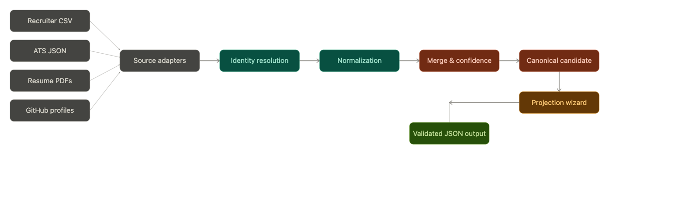
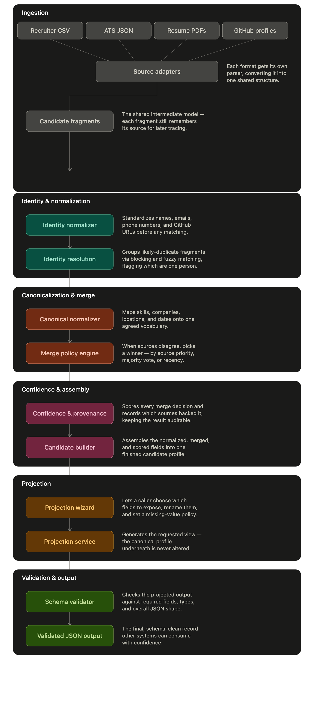
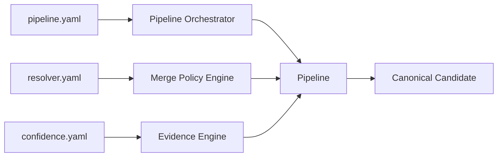

# Candidate Data Transformation Pipeline

> 🚀 **Get started quickly with the [Quick Start Guide](#quick-start).**

An enterprise-inspired, modular data transformation pipeline that ingests heterogeneous candidate data from multiple sources, resolves duplicate identities, normalizes conflicting information, and generates configurable canonical candidate profiles.

Built as part of the Eightfold AI Engineering Internship Assignment.

---

# Problem Statement

Recruitment systems receive candidate information from multiple independent sources such as Recruiter spreadsheets, ATS exports, resumes, and developer profiles.

These sources frequently contain:

- Duplicate candidate records
- Different schemas
- Conflicting values
- Inconsistent formatting
- Missing information

The goal of this project is to design a configurable pipeline that can ingest, normalize, merge, and transform this heterogeneous data into a unified canonical candidate profile while remaining extensible and explainable.

---

# Solution Overview

The pipeline follows a modular ETL-inspired architecture.

Each source is independently ingested, transformed into a common intermediate representation, resolved into unique candidate identities, normalized, merged using configurable strategies, enriched with confidence and provenance, and finally projected into a runtime-configurable output schema.

## High-Level Architecture



---

## Internal Pipeline



---

# Engineering Decisions

## Source Adapters

Each input source is isolated behind an Adapter.

Supported sources

- Recruiter CSV
- ATS JSON
- Resume PDF
- GitHub (Mock)

This makes adding future sources (LinkedIn, Workday, Greenhouse, etc.) straightforward without changing the rest of the pipeline.

---

## Runtime Configurable Merge Engine

Conflicting information is resolved using the Strategy Pattern.

Available strategies

- Weighted Priority
- Majority Vote
- Latest Timestamp

The active strategy is selected through `resolver.yaml` without changing application code.

---

## Runtime Projection

Instead of editing configuration files, the output schema is configured interactively at runtime.

Users can

- Select output fields
- Rename fields
- Configure missing value handling

The canonical candidate always remains unchanged.

---

## Explainable Confidence

Every canonical field stores

- Confidence Score
- Supporting Sources
- Provenance
- Decision Reason

An Overall Candidate Confidence is presented in the CLI while field-level confidence remains available in the generated output.

---

# Configuration

The pipeline behavior is configurable through YAML files.

| Configuration | Purpose |
|--------------|---------|
| `pipeline.yaml` | Pipeline stage ordering |
| `resolver.yaml` | Merge strategy & source priorities |
| `confidence.yaml` | Confidence scoring configuration |

No application code needs to change to alter these behaviors.

---

# Project Structure

```text
candidate-transform-pipeline/

src/
├── adapters/
├── identity/
├── normalization/
├── resolver/
├── confidence/
├── projection/
├── validation/
├── pipeline/
├── models/
├── config/
└── utils/

configs/
input/
output/
test_cases/
tests/
```

---

# Quick Start

## 1. Clone

```bash
git clone <repository-url>

cd candidate-transform-pipeline
```

---

## 2. Create Virtual Environment

### Windows

```bash
python -m venv .venv

.venv\Scripts\activate
```

### Linux / macOS

```bash
python3 -m venv .venv

source .venv/bin/activate
```

---

## 3. Install Dependencies

```bash
pip install -r requirements.txt
```

---

## 4. Run the Pipeline

```bash
python -m src.main run
```

The application automatically loads the bundled multi-source dataset from the `input/` directory.

You may also choose to provide your own dataset interactively.

---

## 5. Inspect the Canonical Schema

```bash
python -m src.main inspect
```

Displays all available canonical fields.

---

## 6. Run the Validation Suite

```bash
python -m src.main test
```

Runs all curated test cases and displays a concise validation dashboard.

---

# CLI Commands

| Command | Description |
|----------|-------------|
| `python -m src.main run` | Execute the complete transformation pipeline |
| `python -m src.main inspect` | Display available canonical fields |
| `python -m src.main test` | Execute all curated validation scenarios |

---

# Validation Suite

The project includes curated test scenarios covering both functionality and edge cases.

| Test | Scenario |
|------|----------|
| TC01 | Happy Path |
| TC02 | Identity Resolution |
| TC03 | Malformed Input Recovery |
| TC04 | Runtime Projection |
| TC05 | Merge Strategy |
| TC06 | Missing Source |
| TC07 | Multi-Source Conflict Resolution |

Each test reports

- Scenario
- Expected Behaviour
- Actual Result
- Overall Candidate Confidence
- Execution Time
- PASS / FAIL

---

# Future Extensions

The modular architecture allows straightforward addition of

- LinkedIn Adapter
- Greenhouse Adapter
- Workday Adapter
- Apache Spark Processing
- Kafka-based Streaming
- REST API
- ML-based Entity Resolution

---

# Technologies

- Python 3.12
- Typer
- Pydantic
- Pandas
- PDFPlumber
- RapidFuzz
- PyYAML
- JSON Schema
- Pytest

---

# Why This Design?

The project is designed around four engineering principles:

- **Extensibility** — New data sources and merge strategies can be added with minimal code changes.
- **Configurability** — Merge policies and pipeline behavior are driven by configuration instead of hardcoded logic.
- **Explainability** — Confidence scores and provenance make every merge decision transparent.
- **Maintainability** — A modular architecture keeps ingestion, normalization, resolution, projection, and validation independent and easy to evolve.

Python 3.12 • Modular Architecture • Adapter Pattern • Strategy Pattern • Runtime Projection • Explainable AI • Config-Driven Pipeline